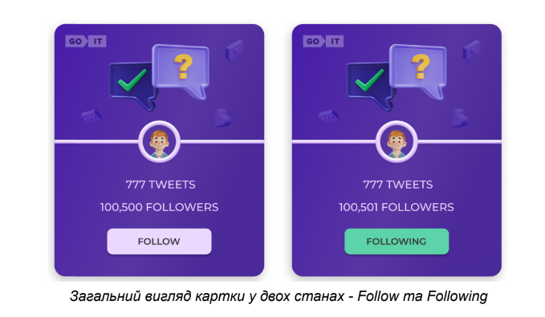

Hello and welcome to this GitHub repository! This project was created with
[Create React App](https://github.com/facebook/create-react-app) and is a test
task from GoIt.

The application is written in React, and the styles are implemented using
module.css. The goal of this task is to create a user card and add interactivity
when the user clicks on the Follow button.

According to the layout, the user card should include an avatar, the number of
followers, the number of tweets, and a Follow button. When the user clicks on
the Follow button, the text on the button changes to Following, and the color of
the button changes. The number of followers should also increase by one. The
final result of the user's actions should be saved when the page is refreshed.

If the user clicks on the button again, the text and color of the button should
return to their original state, and the number of followers should decrease by
one.

To get started with this project, clone the repository to your local machine,
install the necessary dependencies, and then run the project using the command
"npm start". Remember to run "npm run build" before deploying the app in a
production environment.

Thank you for taking the time to read this README file. If you have any
questions or issues, feel free to open an issue in this repository.

Link to the live page - https://qweeqer.github.io/GOITtestTask/

The page template:

The following technologies were used in the development of the project:

- html/css, svg, responsive images;
- js, react, styled components.

**********************************\*\***********************************
## Variables
Creating a new project at mockapi.io
Creating a new fale .env and adding Variables REACT_APP_MOCKAPI_URL for example:
REACT_APP_MOCKAPI_URL=https://YOU_MOCKAPI_PROJECT_ID.mockapi.io/api/v2/users
or add secrets variables to your Repository variables on github 

## Available Scripts

In the project directory, you can run:

### `npm start`

Runs the app in the development mode.\
Open [http://localhost:3000](http://localhost:3000) to view it in your browser.

The page will reload when you make changes.\
You may also see any lint errors in the console.

### `npm test`

Launches the test runner in the interactive watch mode.\
See the section about [running tests](https://facebook.github.io/create-react-app/docs/running-tests)
for more information.

### `npm run build`

Builds the app for production to the `build` folder.\
It correctly bundles React in production mode and optimizes the build for the best
performance.

The build is minified and the filenames include the hashes.\
Your app is ready to be deployed!

See the section about
[deployment](https://facebook.github.io/create-react-app/docs/deployment) for
more information.

### `npm run eject`

**Note: this is a one-way operation. Once you `eject`, you can't go back!**

If you aren't satisfied with the build tool and configuration choices, you can
`eject` at any time. This command will remove the single build dependency from
your project.

Instead, it will copy all the configuration files and the transitive
dependencies (webpack, Babel, ESLint, etc) right into your project so you have
full control over them. All of the commands except `eject` will still work, but
they will point to the copied scripts so you can tweak them. At this point
you're on your own.

You don't have to ever use `eject`. The curated feature set is suitable for
small and middle deployments, and you shouldn't feel obligated to use this
feature. However we understand that this tool wouldn't be useful if you couldn't
customize it when you are ready for it.

## Learn More

You can learn more in the
[Create React App documentation](https://facebook.github.io/create-react-app/docs/getting-started).

To learn React, check out the [React documentation](https://reactjs.org/).

### Code Splitting

This section has moved here:
[https://facebook.github.io/create-react-app/docs/code-splitting](https://facebook.github.io/create-react-app/docs/code-splitting)

### Analyzing the Bundle Size

This section has moved here:
[https://facebook.github.io/create-react-app/docs/analyzing-the-bundle-size](https://facebook.github.io/create-react-app/docs/analyzing-the-bundle-size)

### Making a Progressive Web App

This section has moved here:
[https://facebook.github.io/create-react-app/docs/making-a-progressive-web-app](https://facebook.github.io/create-react-app/docs/making-a-progressive-web-app)

### Advanced Configuration

This section has moved here:
[https://facebook.github.io/create-react-app/docs/advanced-configuration](https://facebook.github.io/create-react-app/docs/advanced-configuration)

### Deployment

This section has moved here:
[https://facebook.github.io/create-react-app/docs/deployment](https://facebook.github.io/create-react-app/docs/deployment)

### `npm run build` fails to minify

This section has moved here:
[https://facebook.github.io/create-react-app/docs/troubleshooting#npm-run-build-fails-to-minify](https://facebook.github.io/create-react-app/docs/troubleshooting#npm-run-build-fails-to-minify)
