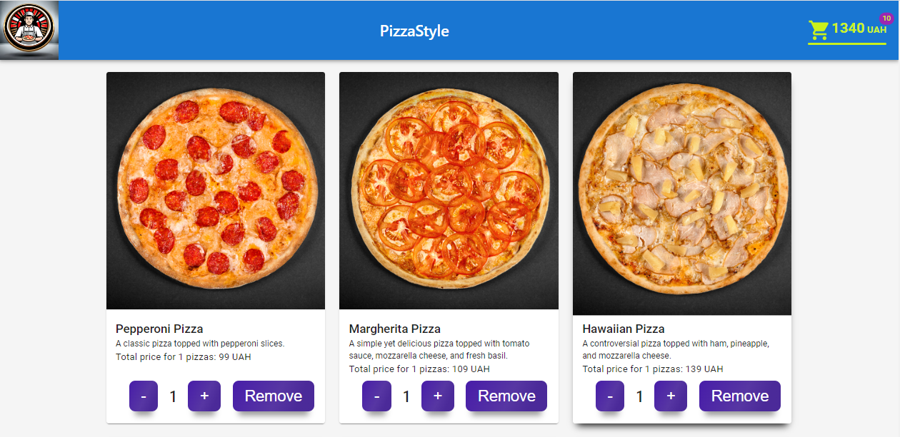

Hello and welcome to this GitHub repository! This project was created with
[Create React App](https://github.com/facebook/create-react-app) and is a test
task from SoftRyzen.

Create a web application "PizzaStyle".

Technologies:
⭐ React
⭐ Redux/Redux Toolkit
⭐ For styling, use module.css or styled-components. You can also use any UI library (React Bootstrap, Tailwind, or Material UI).

Pages:
⭐ Pizza
⭐ Cart

Header:
⭐The header contains the PizzaStyle website logo and navigation. By default, we are on the Pizza page.
⭐If there are added items in the cart, a corresponding number appears next to the cart. If one pizza is added, the number 1 should light up; if 2 pizzas are added, the number 2 should light up accordingly.

PizzaPage:
⭐The page contains a list of product cards.
⭐Each card contains the product image, title, description, price, and "Add to cart" button.
⭐When you press the "Add to cart" button, 2 buttons appear: "-" (minus) and "+" (plus). The number next to Cart in the header also updates.
⭐The "-" (minus) button reduces the quantity of this product in the cart. If there was only one product in the cart, pressing "-" returns the product card to its initial state (the "-" and "+" buttons are replaced with the "Add to cart" button). The number next to Cart in the header also updates or disappears.
⭐The "+" (plus) button increases the quantity of this product in the cart. The number next to Cart in the header updates accordingly.

CartPage:
⭐If the cart is empty, the message "Please, choose pizza here" is displayed, where "here" is a link to the PizzaPage.
⭐If there are items in the cart, the corresponding product cards are displayed.
⭐Each card contains an image, title, description, "-" (minus) button, the quantity of this product in the cart, "+" (plus) button, and the price of this product.
⭐Below the product cards is the text "Total: {Sum of all products} UAH."
⭐Even further below is the "Make an order" button. When you click this button, the cart is completely cleared, and the message "Please, choose pizza here" appears instead of the cards and sum.

Completion criteria:
⭐The code is divided into separate components.
⭐The code should be clean, with preserved formatting. It is recommended to use ESLint/Prettier.
⭐The active link (on which page we are) should be underlined.

Additional, but not mandatory tasks:
⭐Use the CSS Grid algorithm for product card layout.
⭐Add a "Remove" button to each product card in the cart (which can be used to remove the corresponding product from the cart).
⭐The layout is adaptive and cross-browser - mobile from 320px, tablet from 768px, desktop from 1280px.
⭐Use the Mobile-first approach.

Hover effects:
1.Buttons have reverse colors.
2.Product cards on hover:
⭐The product image enlarges (not the card itself) - the image should not go beyond its container.
⭐A shadow appears around the card.

To get started with this project, clone the repository to your local machine,
install the necessary dependencies, and then run the project using the command
"npm start". Remember to run "npm run build" before deploying the app in a
production environment.

Thank you for taking the time to read this README file. If you have any
questions or issues, feel free to open an issue in this repository.

Link to the live page - https://qweeqer.github.io/PizzaStyle/

The page template:

The following technologies were used in the development of the project:

- html/css, svg, responsive images;
- js, react, react components.

********************************************************************

## Available Scripts

In the project directory, you can run:

### `npm start`

Runs the app in the development mode.\
Open [http://localhost:3000](http://localhost:3000) to view it in your browser.

The page will reload when you make changes.\
You may also see any lint errors in the console.

### `npm test`

Launches the test runner in the interactive watch mode.\
See the section about [running tests](https://facebook.github.io/create-react-app/docs/running-tests)
for more information.

### `npm run build`

Builds the app for production to the `build` folder.\
It correctly bundles React in production mode and optimizes the build for the best
performance.

The build is minified and the filenames include the hashes.\
Your app is ready to be deployed!

See the section about
[deployment](https://facebook.github.io/create-react-app/docs/deployment) for
more information.

### `npm run eject`

**Note: this is a one-way operation. Once you `eject`, you can't go back!**

If you aren't satisfied with the build tool and configuration choices, you can
`eject` at any time. This command will remove the single build dependency from
your project.

Instead, it will copy all the configuration files and the transitive
dependencies (webpack, Babel, ESLint, etc) right into your project so you have
full control over them. All of the commands except `eject` will still work, but
they will point to the copied scripts so you can tweak them. At this point
you're on your own.

You don't have to ever use `eject`. The curated feature set is suitable for
small and middle deployments, and you shouldn't feel obligated to use this
feature. However we understand that this tool wouldn't be useful if you couldn't
customize it when you are ready for it.

## Learn More

You can learn more in the
[Create React App documentation](https://facebook.github.io/create-react-app/docs/getting-started).

To learn React, check out the [React documentation](https://reactjs.org/).